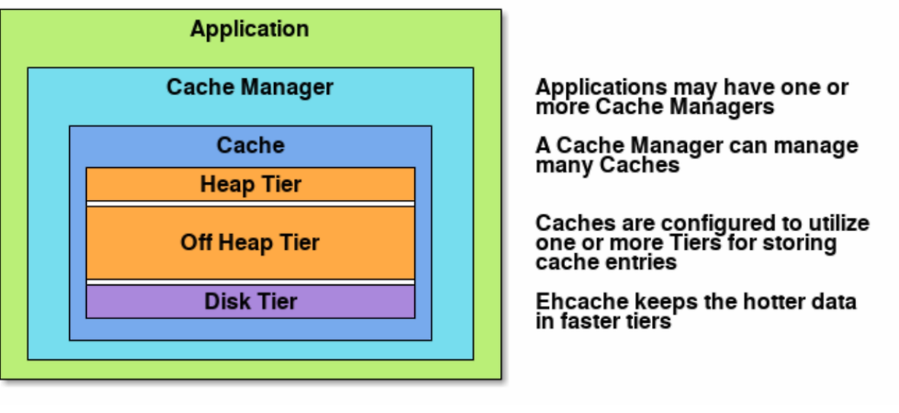

## 콘서트 예약 시스템 캐싱 전략 보고서

### Caching 

#### 캐시는 데이터의 원래 소스보다 더 빠르고 효율적으로 액세스할 수 있는 임시 데이터 저장소를 말한다.
#### 캐시의 데이터는 일반적으로 RAM과 같이 빠르게 액세스할 수 있는 하드웨어에 저장되며, 
#### RAM 및 인 메모리 엔진이 지원하는 높은 요청 비율 또는 IOPS(초당 입력/출력 작업) 덕분에 캐싱을 사용하면 대규모로 데이터 검색 성능이 향상되고 비용이 절감된다.
#### 기존 데이터베이스 및 디스크 기반 하드웨어로 동일한 규모를 지원하려면 추가 리소스가 필요하게 되며,
#### 이러한 추가 리소스는 비용을 상승시키면서도 여전히 인 메모리 캐시에서 제공하는 짧은 지연 시간 성능은 달성할 수 없다.

### Server Caching
#### 1. application level 메모리 캐싱
#### 서버에서 데이터를 캐싱하는 기본적인 방법으로는, 하나의 서버 인스턴스마다의 어플리케이션 메모리에 데이터를 저장해두는 방식을 생각할 수 있다.
#### 대표적인 서버 프레임워크인 Spring framework는 Cache 인터페이스와 CacheManager 인터페이스를 제공, 여러 구현체를 통한 다양한 방식의 어플리케이션 메모리 캐싱을 구현할 수 있도록 하였으며,
#### @Cacheable, @CachePut, @CacheEvict를 이용한 AOP 방식의 캐싱을 가능케했다.
#### 
* #### Spring Caching
    <details>
    <summary>  1. Cache interface </summary>
    <div markdown="1">
  
    #### Cache 인터페이스는 공통된 캐시 기능을 스프링이 추상화 한 것으로, 이를 통해 모든 캐시를 하나의 일관된 인터페이스로 접근 할 수 있다.
    #### Cache 인터페이스의 소스 코드를 보면 다음과 같다.
    ```java
        public interface Cache {
            String getName();
            
            Object getNativeCache();

            @Nullable
            ValueWrapper get(Object key);
        
              @Nullable
              <T> T get(Object key, @Nullable Class<T> type);
            
              @Nullable
              <T> T get(Object key, Callable<T> valueLoader);
            
              @Nullable
              default CompletableFuture<?> retrieve(Object key) {
                    throw new UnsupportedOperationException(this.getClass().getName() + " does not support CompletableFuture-based retrieval");
              }
            
              default <T> CompletableFuture<T> retrieve(Object key, Supplier<CompletableFuture<T>> valueLoader) {
                    throw new UnsupportedOperationException(this.getClass().getName() + " does not support CompletableFuture-based retrieval");
              }
            
              void put(Object key, @Nullable Object value);
            
              @Nullable
              default ValueWrapper putIfAbsent(Object key, @Nullable Object value) {
              ValueWrapper existingValue = this.get(key);
                  if (existingValue == null) {
                    this.put(key, value);
                  }
            
                  return existingValue;
              }
            
              void evict(Object key);
            
              default boolean evictIfPresent(Object key) {
                  this.evict(key);
                  return false;
              }
            
              void clear();
            
              default boolean invalidate() {
                  this.clear();
                  return false;
              }
            
              public static class ValueRetrievalException extends RuntimeException {
              @Nullable
              private final Object key;
            
                    public ValueRetrievalException(@Nullable Object key, Callable<?> loader, @Nullable Throwable ex) {
                        super(String.format("Value for key '%s' could not be loaded using '%s'", key, loader), ex);
                        this.key = key;
                    }
            
                    @Nullable
                    public Object getKey() {
                        return this.key;
                    }
              }
            
              @FunctionalInterface
              public interface ValueWrapper {
                  @Nullable
                  Object get();
              }
        }   
    ```
    #### 기본적으로, 캐시 구현체는 1개의 캐시 이름을 가지며, 캐시의 종류에 따라서 구현이 달라진다. 대표적인 로컬 캐시인 먼저 Caffeine Cache에 대해 살펴보도록 하자.
    #### Caffeine Cache는 로컬 메모리에 값을 저장하는 인메모리 캐시로, ConcurrentHashMap을 사용하여 구현되어 있다.
    #### 예를 들어 우리가 사용자의 이메일을 바탕으로 닉네임 정보를 캐싱하는 UserName 캐시가 존재한다고 하자. 이를 도식화하면 다음과 같다.
    #### 
    #### 
    </div>
    </details>
  
    <details>
    <br>
    <br>
    <summary> 2. CacheManager </summary>
    <div markdown="1"> 
  
    #### 애플리케이션을 개발하다보면 다양한 캐시가 필요할 수 있다.
    #### 위에서 살펴본 UserName 캐시 외에도 UserPhone 캐시 등 다양한 캐시 객체가 필요할 수 있다.
    #### 스프링은 이러한 캐시 객체들을 관리하는 CacheManager라는 인터페이스를 제공한다. 자세한 구조를 표현하면 다음과 같다.
    #### 
    #### Cache 인터페이스와 유사하게, CacheManager 역시 캐시 목록을 관리하는 기능을 추상화된 인터페이스이다. CacheManager 인터페이스를 살펴보면 다음과 같다.
    ```java
          public interface CacheManager extends Closeable {
              CachingProvider getCachingProvider();

              URI getURI();
          
              ClassLoader getClassLoader();
          
              Properties getProperties();
          
              <K, V, C extends Configuration<K, V>> Cache<K, V> createCache(String var1, C var2) throws IllegalArgumentException;
          
              <K, V> Cache<K, V> getCache(String var1, Class<K> var2, Class<V> var3);
          
              <K, V> Cache<K, V> getCache(String var1);
          
              Iterable<String> getCacheNames();
          
              void destroyCache(String var1);
          
              void enableManagement(String var1, boolean var2);
          
              void enableStatistics(String var1, boolean var2);
          
              void close();
          
              boolean isClosed();
          
              <T> T unwrap(Class<T> var1);
          }
    ```
    #### CacheManager는 여러 개의 캐시를 관리하므로, 캐시 이름(Cache Name)으로 캐시를 조회하는 기능이 존재한다.
    #### 따라서 캐시 매니저에게 특정한 캐시를 가져오도록 우리가 @Cacheble을 사용할 때 cacheNames를 지정해주는 것이다.
    ```java
        @Cacheable(cacheNames = [CacheKey.HOLIDAYS], cacheManager = "localCacheManager", key = "#year", )
            override fun getHolidays(year: Int): List<LocalDate> {
            return fetchDataApiPort.getHolidays(year)
        }
    ```
    #### 그 외에도 전체 캐시 이름 목록을 조회하는 메서드도 갖고 있다.
    #### 여기서 주의할 부분은 getCache 메서드 부분인데, 설명을 보면 구현체에 따라 캐시 매니저의 캐시가 lazy하게 생성될 수 있다는 부분이다.
    #### 이를 보다 자세히 이해하기 위해 CacheManager 구현을 살펴보도록 하자.
    
    #### 
    
    #### CacheManager 계층 구조를 살펴보면 다양한 구현체들이 존재함을 확인할 수 있다. 그 중에서 로컬 캐시를 위해 사용되는 SimpleCacheManager를 먼저 살펴보도록 하자.
    #### 
    #### SimpleCacheManager는 내부적으로 ConcurrentHashMap을 사용하여 단일 인스턴스 내부에서 캐싱하기 위한 용도로 활용되는 CacheManager이다.
    #### SimpleCacheManager의 계층 구조를 자세히 보면, 실질적인 기능들은 공통 기능을 추상화한 AbstractCacheManager에 존재함을 확인할 수 있다.
    ```java
    public abstract class AbstractCacheManager implements CacheManager, InitializingBean {
           private final ConcurrentMap<String, Cache> cacheMap = new ConcurrentHashMap(16);
           private volatile Set<String> cacheNames = Collections.emptySet();
           
           @Nullable
           public Cache getCache(String name) {
                Cache cache = (Cache)this.cacheMap.get(name);
                if (cache != null) {
                        return cache;
                } else {
                    Cache missingCache = this.getMissingCache(name);
                        
                    if (missingCache != null) {
                            synchronized(this.cacheMap) {
                                cache = (Cache)this.cacheMap.get(name);
                                if (cache == null) {
                                    cache = this.decorateCache(missingCache);
                                    this.cacheMap.put(name, cache);
                                    this.updateCacheNames(name);
                                }
                            }   
                    }
    
                    return cache;
              }
          }
    }
    ```
    #### AbstractCacheManager 클래스의 getCache 메서드를 보면 CacheManager에서 캐시를 꺼내고 존재하지 않는 경우에는 put하는 것을 확인할 수 있다.
    #### 우리가 흔히 사용하는 SimpleCacheManager와 RedisCacheManager 모두 해당 클래스를 상속받으므로, 캐시가 없다면 예외가 발생하지 않고 lazy하게 새로운 캐시가 생성된다.
    
    #### 하지만 실제 서비스를 운영할 때는 로컬 캐시 외에도 레디스와 같은 분산 저장소의 캐시 모두 필요하다.
    #### 따라서 스프링은 로컬 캐시를 위해서는 SimpleCacheManager, 레디스를 위해서는 RedisCacheManager를 제공하며,
    #### 복수의 CacheManager 들을 관리하기 위한 CompositeCacheManager 역시 제공한다.
    #### 
    #### CompositeCacheManager는 이름 그대로 디자인 패턴 중 컴포지트 패턴을 적용한 것으로, 내부 구현을 보면 복수의 CacheManager들을 순차 접근하여 처리하는 방식으로 동작함을 확인할 수 있다.
    ```java
    public class CompositeCacheManager implements CacheManager, InitializingBean {
        private final List<CacheManager> cacheManagers = new ArrayList();
        private boolean fallbackToNoOpCache = false;
        
        @Override
        @Nullable
        public Cache getCache(String name) {
           for (CacheManager cacheManager : this.cacheManagers) {
                Cache cache = cacheManager.getCache(name);
                if (cache != null) {
                    return cache;
                }
           }
           return null;
        }
    
    }
    ``` 
    #### 따라서 우리가 CompositeCacheManager를 기반으로 @Cacheable을 사용할 때 cacheNames와 더불어 cacheManager를 지정해주어야 하는 이유가 바로 어떠한 캐시 매니저에서 어떠한 캐시 이름에 접근할 것인지 정보가 필요하기 때문이다.
    ```java
      @Cacheable(cacheNames = [CacheKey.HOLIDAYS], cacheManager = "localCacheManager", key = "#year", )
      override fun getHolidays(year: Int): List<LocalDate> {
              return fetchDataApiPort.getHolidays(year)
      }
    ```
    #### CacheAspectSupport는 AOP 기반의 선언형 캐시(declarative cache) 처리 로직을 담고 있는 클래스이다.
    #### 따라서 CacheAspectSupport에서 @Cacheable이나 @CacheEvict 등과 같은 애노테이션을 파싱하고, 요청을 처리하는 실질적인 기능을 수행한다.
    #### CacheInterceptor는 CacheAspectSupport의 자식 클래스인데, 많은 캐시 처리 부분 중에서 캐시 호출의 올바른 제어를 위해 추가 기능을 갖고 있다.
    #### CacheInterceptor의 계층 구조는 다음과 같은데, 그 중에서 부모 클래스인 AbstractCacheInvoker가 실제로 get, put, evict 등의 호출을 담당한다.
    #### 
    #### 실제 get, put, evict 메서드에 대한 호출 로직은 CacheAspectSupport에 존재하는데 실제 구현체는 CacheInterceptor이므로,
    #### 우리가 해당 클래스를 상속받아 get, put, evict와 같은 기능을 오버라이딩하면 get, put, evict 요청 시에 필요에 따라 개입할 수 있다.    
    </div>
    </details>
  


#### 2. external level 캐시 서비스

#### 앞서 알아본 application level에서의 메모리 캐싱의 경우, 속도가 빠르고 비용이 저렴하다는 장점이 있지만, 
#### 어플리케이션이 종료될 시, 캐시 데이터가 삭제되고, 가동 중인 인스턴스 메모리를 이용하므로, 메모리 부족 문제가 발생할 수 있으며,
#### 분산 환경 시스템으로 구축된 경우, 각 인스턴스 내 애플리케이션 간의 정합성이 월등히 떨어진다는 치명적인 단점이 존재한다.
#### 따라서 이와 같은 applicatoin level에서의 메모리 캐싱의 문제를 효과적으로 해결하기 위한 방법으로, 
#### 어플리케이션이 설치된 서버 인스턴스들과는 별도로 외부에 데이터 캐싱 전용 서버와 서비스를 이용하는 방식을 채택할 수 있다.
#### 이 때 가장 대표적으로 이용되는 서비스가 Redis의 캐싱 기능이다.

* #### Redis
  * #### Redis is equal to Caching ? 
      #### 위와 같이 application level에서의 메모리 캐싱의 문제점을 해결하기 위해서 Redis의 캐싱 기능을 주로 이용한다 했는데,
      #### 그렇다고 해서 Redis가 오로지 캐싱을 하기 위한 서비스라고 이해해선 안 된다.
      #### 이를 이해하기 위해선 Redis 자체에 대한 이해가 필요하다.
  
  * #### What is Redis ?
      #### Redis는 "Remote Dictionary Server"의 약자로, Remote(원격)에 위치하고, 프로세스로 존재하는 In-Memory 기반의 Dictionary(key-value) 구조 데이터 관리 Server 시스템이다.
      #### 여기서 key-value 구조 데이터란, mysql 같은 관계형 데이터가 아닌 비 관계형 구조로서, 데이터를 그저 '키-값' 형태로 단순하게 저장하는 구조를 말한다.
      #### 그래서 관계형 데이터베이스와 같이 쿼리 연산을 지원하지 않지만, 대신 데이터의 고속 읽기와 쓰기에 최적화되어 있다. 그래서 Redis는 일종의 NoSQL로 분류되기도 한다.

  * #### NoSQL ?
      #### Not Only SQL의 약자로, 기존 관계형 데이터베이스보다 더 융통성있는 데이터 모델을 사용하고 데이터의 저장 및 검색을 위한 특화된 매커니즘을 제공하는 데이터 저장 기술을 의미한다.
      #### NoSQL 데이터베이스는 단순 검색 및 추가 작업에 있어서 매우 최적화된 키-값 저장 기법을 사용하여 응답 속도나 처리 효율 등에 있어서 매우 뛰어난 성능을 보여준다.
  * #### Redis Data Structure
      <details>
        <summary>Redis Key Naming Convention</summary>
      <div markdown="1">
        
       #### redis key name은 가독성과 일관성, 검색의 용이함과 확장성을 고려해야 한다. 
       #### 이를 위해 redis key를 naming은 콜론(:)을 활용해 계층적으로 의미를 구분한 형식을 주로 사용한다.
       #### ex)  users:100:profile, products:123:details
      </div>
      </details>
    
      <details>
      <summary> Redis는 key-value 구조로서 value의 타입으로 다양한 자료구조를 지원한다. </summary>
      <div markdown="1">
        
       #### 1. String 타입 데이터
       일반적인 문자열로, 값은 최대 512MB, String으로 될 수 있는 binary data, JPEG 이미지도 저장 가능하다.
       <br>
       <br>
       단순 증감 연산에 사용하기 용이하다.
       <br>
       <br>
       명령어 리스트 
       * SET  : SET, SETNX, SETEX, SETPEX, MSET, MSETNX, APPEND, SETRANGE
       * GET  : GET, MGET, GETRANGE, STRLEN
       * INCR : INCR, DECR, INCRBY, DECRBY, INCRBYFLOAT
       * Enterprise : SETS, DELS, APPENDS
       ```redis 
              127.0.0.1:6379> set user::100::point 1000
              OK
              127.0.0.1:6379> get user::100::point
              "1000"
              127.0.0.1:6379> set count 100
              OK
              127.0.0.1:6379> get count
              "100"
              127.0.0.1:6379> incr count
              (integer) 101
              127.0.0.1:6379> get count
              "101"
              127.0.0.1:6379> incrby count 100
              (integer) 201
              127.0.0.1:6379> decr count
              (integer) 200
              127.0.0.1:6379> decrby count 100
              (integer) 100
              127.0.0.1:6379> get count
              "100"
              127.0.0.1:6379> mset user::101::point "100" user::102::point "100"
              OK
              127.0.0.1:6379> mget user::101::point user::102::point
              1) "100"
              2) "100"       
       ```
       #### 2. List 타입 데이터
       array 형식의 데이터 구조, 데이터를 순서대로 저장
       <br>
       <br>
       중간의 특정 Index 값을 조회할 때는 속도가 느리기 때문에 push/pop 연산을 통해 head-tail에서 추가/삭제한다.
       <br>
       <br>
       메세지 queue로 사용하기 적절하다.
       <br>
       <br>
       명령어 리스트
       * SET(PUSH) : LPUSH, RPUSH, LPUSHX, RPUSHX, LSET, LINSERT, RPOPLPUSH
       * GET : LRANGE, LINDEX, LLEN
       * POP : LPOP, RPOP, BLPOP, BRPOP
       * REM : LREM,LTRIM
       * BLOCK : BLPOP, BRPOP, BRPOPLPUSH
       * Enterprise : LREVERANGE, LPUSHS, RPUSHS
       ```redis
            127.0.0.1:6379> LPUSH users "jane"
            (integer) 1
            127.0.0.1:6379> LRANGE users 0 -1
            1) "jane"
            127.0.0.1:6379> LPUSH users "john"
            (integer) 2
            127.0.0.1:6379> RPUSH users "roni"
            (integer) 3
            127.0.0.1:6379> LRANGE users 0 -1
            1) "john"
            2) "jane"
            3) "roni"
            127.0.0.1:6379> LPUSHX users2 "jane"
            (integer) 0
            127.0.0.1:6379> LPUSH users "lynn"
            (integer) 4
            127.0.0.1:6379> LPOP users
            "lynn"
            127.0.0.1:6379> RPOP users
            "roni"
            127.0.0.1:6379> LRANGE users 0 -1
            1) "john"
            2) "jane"
            127.0.0.1:6379> LLEN users
            (integer) 2
            127.0.0.1:6379> LREM users 0 "jame"
            (integer) 0
            127.0.0.1:6379> LREM users 0 "jane"
            (integer) 1
            127.0.0.1:6379> LRANGE users 0 -1
            1) "john"
            127.0.0.1:6379> LSET users 0 "jamie"
            OK
            127.0.0.1:6379> LRANGE users 0 -1
            1) "jamie"
            127.0.0.1:6379> RPOPLPUSH users admins
            "jamie"
            127.0.0.1:6379> LRANGE admins 0 -1
            1) "jamie"        
       ```
       #### 3. Hash 타입 데이터 
       field-value로 구성되어있는 전형적인 hash의 형태 
       <br>
       <br>
       key 하위에 subkey를 이용해 추가적인 HashTable을 제공하는 자료구조
       <br>
       <br>
       메모리가 허용하는 한, 제한없이 field들을 넣을 수 있다.
       <br>
       <br>
       명령어 리스트
       * SET : HSET, HMSET, HSETNX
       * GET : HGET, HMGET, HLEN, HKEYS, HVALS, HGETALL, HSTRLEN, HSCAN, HEXISTS
       * REM : HDEL
       * INCR : HINCRBY, HINCRBYFLOAT
       ```redis
            127.0.0.1:6379> hset users::100::details name jinmin year 1995 month 3
            (integer) 3
            
            127.0.0.1:6379> hget users::100::details name
            "jinmin"
            
            127.0.0.1:6379> hget users::100::details year
            "1995"
            
            127.0.0.1:6379> hdel users::100::details year
            (integer) 1
            
            127.0.0.1:6379> hlen users::100::details
            (integer) 2
            
            127.0.0.1:6379> hgetAll users::100::details
            1) "name"
            2) "jinmin"
            3) "month"
            4) "3"
            
            127.0.0.1:6379> hkeys users::100::details
            1) "name"
            2) "month"
            
            127.0.0.1:6379> hvals users::100::details
            1) "jinmin"
            2) "3"
       ```
       #### 4. Set 타입 데이터
       중복된 데이터를 담지 않기 위해 사용하는 자료구조
       <br>
       <br>
       유니크한 key 값
       <br>
       <br>
       정렬되지 않은 집합
       <br>
       <br>
       중복된 데이터를 여러 번 저장하면, 최종 한 번만 저장된다. 
       <br>
       <br>
       Set 간의 연산을 지원, 교집합, 합집합, 차이를 매우 빠르게 추출할 수 있다.
       <br>
       <br>
       명령어 리스트
       * SET : SADD, SMOVE
       * GET : SMEMBERS SCARD, SRANDMEMBER, SISMEMBER, SSCAN
       * POP : SPOP
       * REM : SREM
       * 집합 연산 : SUNION, SINTER, SDIFF, SUNIONSTORE, SINTERSTORE, SDIFFSTORE
       * Enterprise : SLS, SRM, SLEN, SADDS
       ```redis
            127.0.0.1:6379> sadd myset a
            (integer) 1
            
            127.0.0.1:6379> sadd myset a
            (integer) 0
            
            127.0.0.1:6379> sadd myset b
            (integer) 1
            
            127.0.0.1:6379> sadd myset c
            (integer) 1
            
            127.0.0.1:6379> srem myset c # 삭제된 member 갯수 반환
            (integer) 1
            
            127.0.0.1:6379> smembers myset
            1) "b"
            2) "a"
            
            127.0.0.1:6379> scard myset
            (integer) 2
            
            127.0.0.1:6379> sadd myset c d e f # 여러 member 삽입 가능
            (integer) 4
            
            127.0.0.1:6379> smembers myset
            1) "d"
            2) "c"
            3) "a"
            4) "f"
            5) "b"
            6) "e"
            
            127.0.0.1:6379> spop myset 3 # 랜덤 member 삭제
            1) "d"
            2) "c"
            3) "f"
            
            127.0.0.1:6379> smembers myset
            1) "a"
            2) "b"
            3) "e"
       ```
       #### 5. Sorted Set 타입 데이터
       Set에 score 필드가 추가된 데이터 형태
       <br>
       <br>
       일반적으로 Set은 정렬되어 있지 않고 insert한 순서대로 들어가지만, 
       <br>
       <br> 
       Sorted Set은 Set의 특성을 그대로 가지며, 저장된 member들의 순서도 관리한다.
       <br>
       <br>
       데이터가 저장될 때부터 score 순으로 정렬되며 저장
       <br>
       <br>
       Sorted Set에서 데이터는 데이터는 오름차순으로 내부 정렬
       <br>
       <br>
       value는 중복 불가하지만, score는 중복 가능
       <br>
       <br>
       만약 score 값이 같으면 사전 순으로 정렬되어 저장
       <br>
       <br>
       명령어 리스트
       * SET : ZADD
       * GET : ZRANGE, ZRANGEBYSCORE, ZRANGEBYLEX, ZREVRANGE, ZRANK, ZREVRANK, ZSCORE, ZCARD, ZCOUNT, ZSCAN
       * POP : ZPOPMIN, ZPOPMAX
       * REM : ZREM, ZREMRANGEBYRANK
       * INCR : ZINCRBY
       * 집합연산 : ZUNIONSTORE, ZINTERSTORE
       * Enterprise : ZISMEMBER, ZLS, ZRM, SLEN, SADDS
       ```redis
             127.0.0.1:6379> ZADD tokens 1 user1
             (integer) 1
             127.0.0.1:6379> ZADD tokens 2 user2    
             (integer) 1    
             127.0.0.1:6379> ZADD tokens 3 user3 4 user4    
             (integer) 2    
             127.0.0.1:6379> ZADD tokens 10 user1    
             (integer) 0    
             127.0.0.1:6379> ZSCORE tokens user1    
             "10"    
             127.0.0.1:6379> ZRANK tokens user1    
             (integer) 3    
             127.0.0.1:6379> ZRANK tokens user2    
             (integer) 0    
             127.0.0.1:6379> ZRANK tokens user3    
             (integer) 1    
             127.0.0.1:6379> ZRANK tokens user4    
             (integer) 2    
             127.0.0.1:6379> ZRANGE tokens 0 -1    
             1) "user2"    
             2) "user3"    
             3) "user4"    
             4) "user1"    
    ```
       </div>
       </details>
  


### Caching Strategy
* #### Read Strategy
<details>                                       
  <summary>1. Look Aside</summary>
  <div markdown="1">
   
   #### 

   #### 데이터를 찾을 때 우선 캐시에 저장된 데이터가 있는지 우선적으로 확인하는 전략, 만일 캐시에 데이터가 없으면 DB에서 조회
   #### 반복적인 읽기가 많은 호출에 적합
   #### 캐시와 DB가 분리되어 가용되기 때문에 원하는 데이터만 별도로 구성하여 캐시에 저장할 수 있고, 캐시 장애 대비 구성이 되어있다.
   #### redis 서버가 다운되면 순간적으로 DB로 몰려서 부하가 발생할 수 있다. 
   #### Cache Store와 Data Store 간 "정합성 유지 문제"가 발생할 수 있으며, 초기 조회 시 무조건 Data Store를 호출해야 하므로 
   #### 단건 호출 빈도가 높은 서비스에 적합하지 않은 대신, 반복적으로 동일 쿼리를 수행하는 서비스에 적합한 아키텍처이다.
   * CacheWarming   
   <br> 
     * 미리  cache로 데이터를 밀어 넣어두는 작업을 의미한다.
     * 이 작업을 수행하지 않으면, 서비스 초기에 트래픽 급증 시 대량의 cache miss 발생하여 데이터 베이스 부하가 급증할 수 있다. 
     * 다만, 캐시 자체는 용량이 작아, 무한정으로 데이터를 들고 있을 수는 없어 일정 시간이 지나면, expire 되는데, 그러면 다시 Thundering Herd가 
     발생될 수 있기 때문에, 캐시의 TTL을  잘 조정할 필요가 있다. 
   </div>
</details>

<details>                                                                                                                        
  <summary>2. Read Through</summary>                                                                                               
  <div markdown="1">                                                                                                             

   #### 

                                                                                                                               
   #### 캐시에서만 데이터를 읽어오는 전략                                                     
   #### Look Aside와 비슷하지만, 데이터 동기화를 라이브러리 또는 캐시 제공자에게 위임하는 방식이라는 차이가 있다.                                                                                                      
   #### 따라서, 데이터를 조회하는데 있어, 전체적으로 속도가 느림.                                            
   #### 또한 데이터 조회를 전적으로 캐시에만 의지하므로, redis가 다운될 경우 서비스 이용에 차질이 생길 수 있다.                                                                            
   #### 대신에, 캐시와 DB 간의 데이터 동기화가 항상 이루어져 데이터 정합성 문제에서 벗어날 수 있다. 
   #### 읽기가 많은 워크로드에 적합하다. 

   </div>                                                                                                                           
</details> 

* #### Write Strategy
<details>
<summary>1. Write Through</summary>
<div markdown="1">

  #### 

    
  #### 데이터베이스와 Cache에 동시에 데이터를 저장하는 전략
  #### 데이터를 저장할 때 먼저 캐시에 저장한 다음 바로 DB에 저장
  #### Read Through와 마찬가지로 DB 동기화 작업을 캐시에게 위임
  #### DB와 캐시가 항상 동기화 되어있어, 캐시의 데이터는 항상 최신 상태로 유지
  #### 데이터 유실이 발생하면 안 되는 상황에 적합
  #### 매 요청마다 두 번의 Write가 발생하게 됨으로써 빈번한 생성, 수정이 발생하는 서비스에서는 성능 이슈 발생
</div> 
</details>

<details>
<summary>2. Write Around</summary>
<div markdown="1">

   #### 

    
   #### Write Through보다 훨씬 빠름 
   #### 모든 데이터는 DB에 저장 (캐시를 갱신하지 않음) 
   #### Cache Miss가 발생하는 경우에만 DB와 캐시에도 데이터를 저장
   #### 따라서 캐시와 DB 내의 데이터가 다를 수 있음.
   #### Write Around 패턴은 속도가 빠르지만, cache miss가 발생하기 전에 데이터베이스에 저장된 데이터가 수정되었을 때,
   #### 사용자가 조회하는 cache와 데이터베이스 간의 데이터 불일치가 발생하게 된다. 
   #### 따라서 데이터베이스에 저장된 데이터가 수정, 삭제될 때마다, Cache 또한 삭제하거나 변경해야 하므로, Cache expire 주기를 짧게 조정하는 것이 필요하다.

</div>
</details>

### Cache Stampede Issue

#### 


* #### 문제 상황 
    #### 대규모 트래픽이 환경에서 TTL 값이 너무 작게 설정하면, cache stampede 현상이 발생할 가능성이 높다.
    #### 캐시 읽기 시 Look Aside 전략을 사용할 시,  redis에 데이터가 없다는 응답을 받은 서버가 직접 DB로 데이터를 요청한 뒤, 
    #### 다시 redis에 저장하는 과정을 거친다. 그런데 이 상황에서 key가 만료되는 순간, 많은 서버에서 이 key를 통해 데이터를 읽으려 하고 있었다면,
    #### 해당 모든 어플리케이션 서버에서 DB를 향해 읽기 요청을 보내는 duplicate read가 발생한다.
    #### 또한 읽어온 값을 각각 redis에 쓰는 duplicate write도 발생되는 등, 요청양 폭주로 인한 장애가 발생할 수 있다.
* #### 해결책
    #### 1. 랜덤화된 캐시 만료 시간 설정 
    #### 동일한 시점에 여러 캐시 항목이 한꺼번에 만료되는 것을 방지하기 위해 TTL에 랜덤 값을 추가하여 만료 시간을 분산.
    #### 2. 스케줄러를 이용한 캐시 백그라운드 갱신
    #### 캐시가 만료되기 전에 백그라운드에서 데이터를 미리 갱신하여 클라이언트가 캐시 미스를 겪지 않도록 한다.
    #### 3. 분산락을 적용한 Soft Expiration (캐시 만료 직전 비동기 갱신) 구현
    #### 캐시 만료되기 직전에 기존의 데이터는 그대로 반환하고 비동기로 db로부터 redis 갱신 작업을 진행한다.
    #### 이 때, db 부하를 감소시키기 위해 분산락을 이용하여 첫 번째 갱신 요청만 수행하도록 한다.
    #### 4. resilience4j의 서킷브레이커 패턴을 이용 
    #### Resilience4j의 서킷 브레이커를 사용하여 캐시 미스 발생 시 데이터베이스로의 요청 폭주를 방지할 수 있습니다.
    #### 캐시가 만료되거나 데이터베이스 부하가 높은 경우 Fallback 메서드를 통해 임시 데이터를 제공하거나 오류를 graceful하게 처리할 수 있습니다
    #### 실제 시스템에서는 서킷 브레이커, Request Collapsing, Soft Expiration 등을 결합하여 안정적인 캐시 시스템을 운영할 수 있습니다.

### 대기열 토큰 캐싱 전략
 
#### 대기열 토큰의 경우, 데이터의 만료 주기가 짧고 데이터의 영속성이 중요하지 않기 때문에
#### 기존의 데이터베이스에 대기열 토큰 정보를 저장하고 관리하던 방식을 Redis에 대기열 토큰 정보를 전부 저장하고 관리하는 방식으로 
#### 완전히 대체하도록 할 것이다. 대기열 토큰 정보는 데이터의 영속성은 중요치 않은데, 조회는 자주 일어날 것이기 때문에 
#### DB를 이용하지 않고, 캐싱만으로 그 정보들을 관리하는 것이 훨씬 효율적이라 판단하였다. 
#### 1. 대기열 토큰 정보들을 value 타입이 Sorted Set인 캐시 wating_tokens에 저장
#### 2. wating_tokens의 TTL은 11분으로 하되, 새로 데이터가 추가될 때마다 새로 11분으로 갱신
#### 3. 스케줄러를 이용해 RedisTemplate의 opsForZSet 메소드와 range 메소드를 이용하여 상위 10 개씩 wating_tokens에서 삭제하고
#### 4. 상위 10개 대기열 토큰 정보들을 key에 각각의 대기열 토큰 ID가 있고, TTL이 10분인 각각의 캐시 공간에 Hash 타입으로 저장해놓고 
#### 5. 토큰 검증 시 가져온 토큰 ID로 Redis에서 조회하여 존재하고 userId가 일치하면, 활성화된 토큰으로 판별한다.

### 유저 포인트 캐싱 전략 

#### 유저 포인트는 금액과 관련돼 정합성이 굉장히 중요하기 때문에 오직 데이터베이스에서만 그 정보를 저장하고 관리하는 것이 
#### 좋지 않을까 싶었다. 하지만, 유저 포인트는 유저 관련 정보 중 가장 자주 들여다 볼 정보이며, 정합성이 굉장히 중요한 데이터를 캐싱으로  
#### 문제없이 빠르고 정확하게 관리하는 것도 하나의 Mission이 될 것이라 생각하여, 유저 포인트 캐싱을 생각해보았다.
#### 유저 포인트의 경우,


### 콘서트 조회 캐싱 전략

### 콘서트 좌석 조회 캐싱 전략
