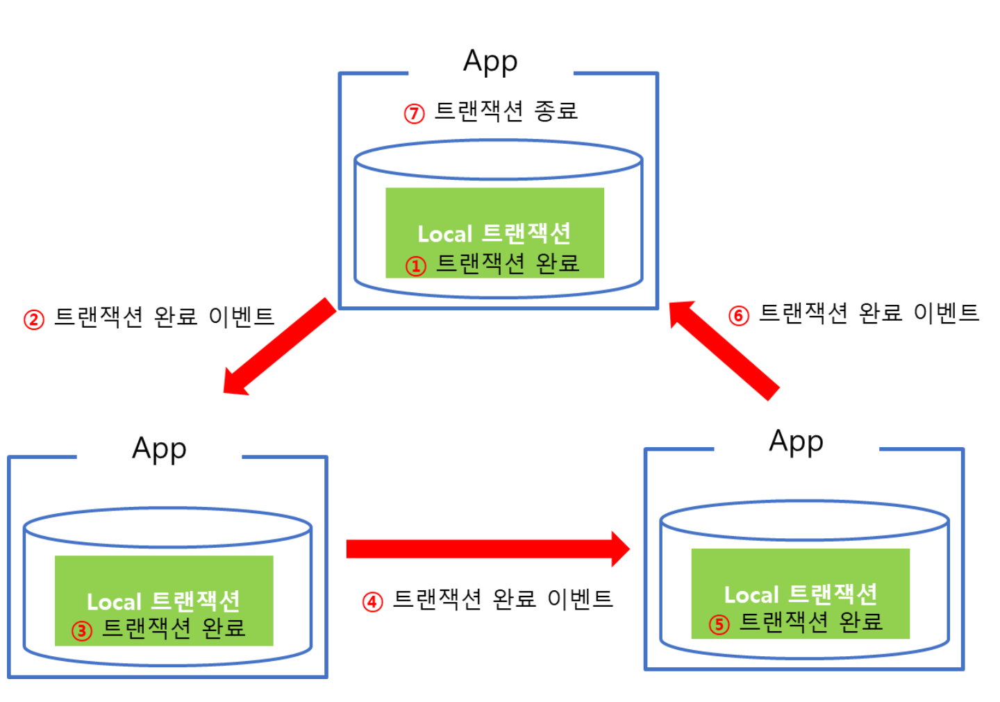
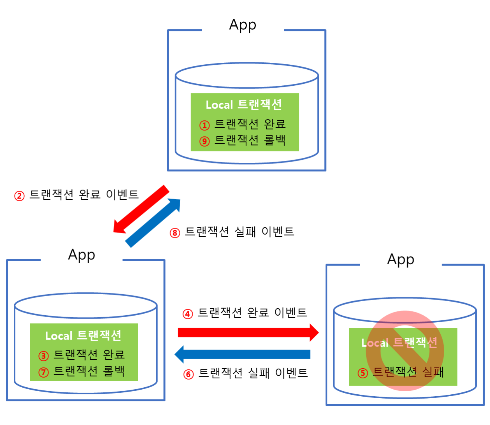
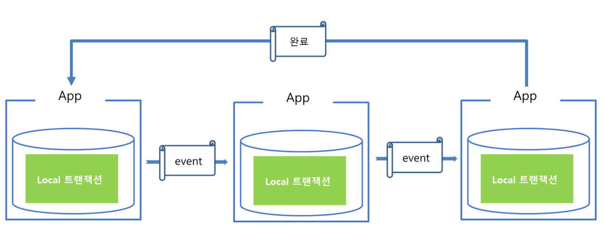
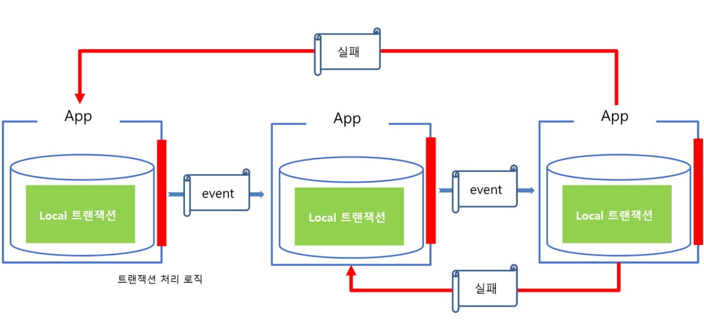
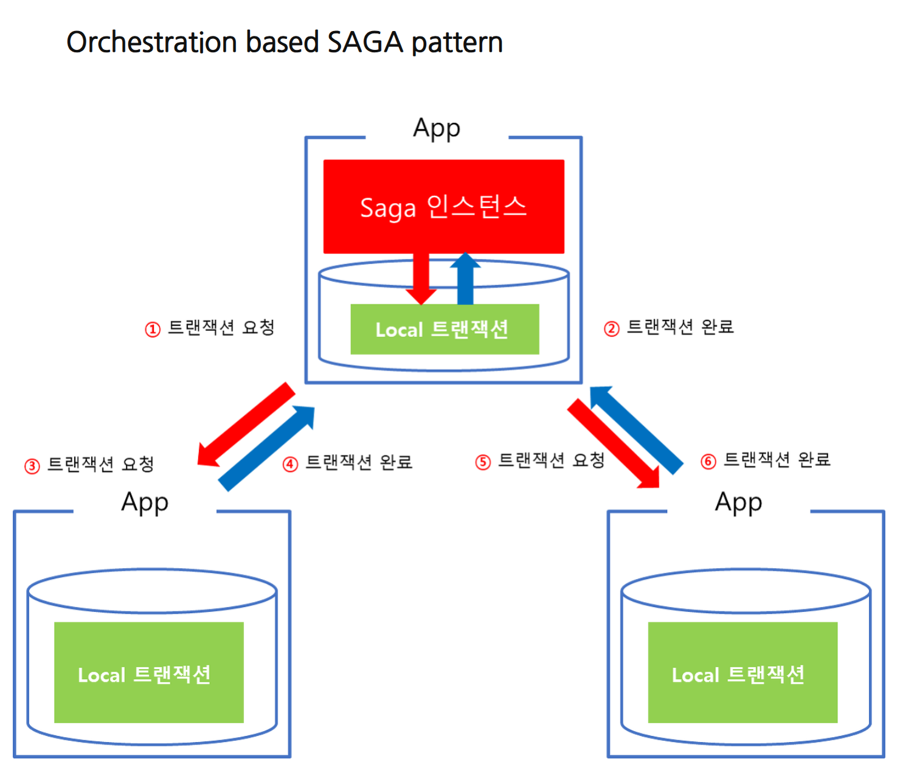
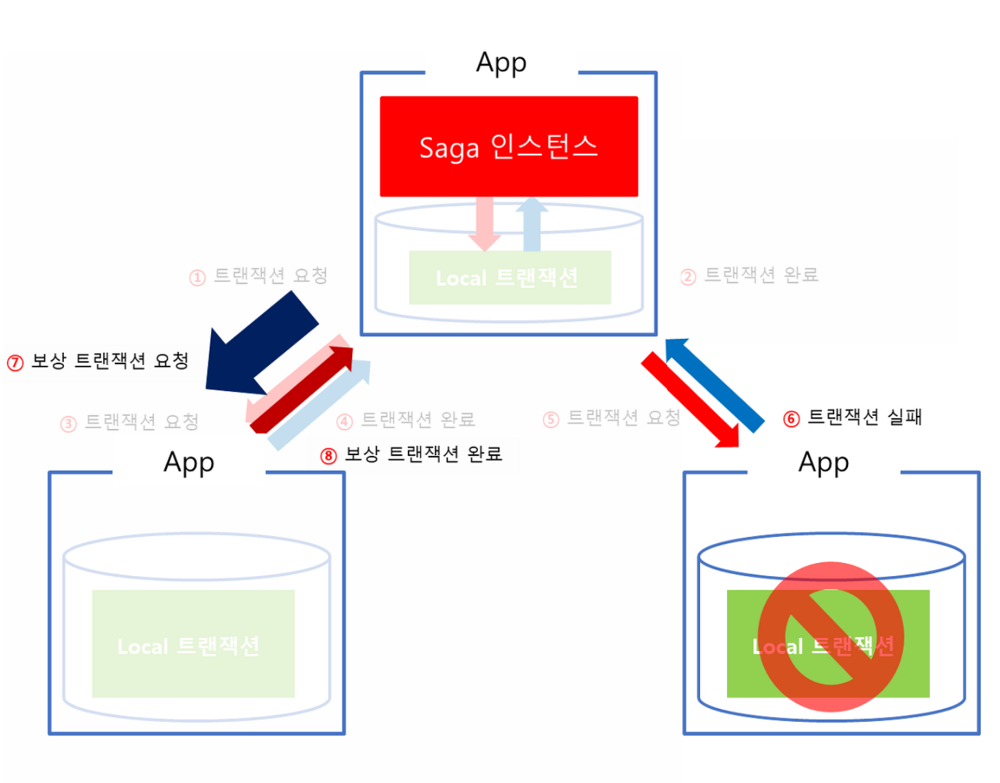

## 이벤트 기반 프로그래밍

### 1. 마이크로서비스 아키텍처

* #### 마이크로서비스 아키텍처란, 도메인을 중심으로 서비스를 모델링하고 구현하는 아키텍처로, 도메인 별로 서비스, DB 등이 물리적, 논리적으로 분리돼있으며, 이렇게 분리된 도메인 서비스들은 HTTP API 또는 비동기 메시징 방식으로 통신한다.

* #### 필요성
  * #### 기존의 모놀로틱 방식 프로젝트에서, 도메인을 기준으로 도메인별 어플리케이션 서버와 DB 등을 분리하게 되는 결정적인 이유는, 도메인 별로, 처리하는 작업량과 걸리는 부하가 가지각색이므로, 이에 유연하게 대처하기 위함이다.
  * #### 또한, 도메인 별로 어플리케이션 서버와 DB 등을 분리함으로써, 서버의 확장성이 좋아지고, 소스 코드의 수정과 배포가 용이해지며, 도메인 별 소스 간 결합도를 낮출 수 있다.
  * #### 이러한 이유로, 모놀리틱 방식의 서비스 규모가 점점 확장되는 경우, 마이크로서비스 아키텍처로의 전환을 고민하게 되는 것이다.  

* #### 한계
  * #### 1. 트랜잭션 관리 문제 : 각 도메인 별 서비스는 독립적으로 동작하기 때문에 여러 서비스에서 동시에 발생하는 트랜잭션을 관리하기 어렵다.
  * #### 2. 데이터 일관성 문제 : 독립적인 서비스는 각자의 데이터를 가지고 있어, 전체 시스템의 데이터 일관성을 유지하는 것이 어렵다.
  * #### 3. 서비스 간 통신 복잡성 문제 : 각 서비스는 독립적으로 배포되고 다른 서비스와 통신하며, 이로 인해 통신 복잡성이 증가하고 네트워크 지연이나 통신 오류가 발생할 수 있다.

### 2. 이벤트 기반 프로그래밍
  
* #### 이벤트 기반 프로그래밍이란, 시스템 내의 특정 이벤트들에 반응하여 코드를 실행하는 프로그래밍 패러다임이다.
* #### 이벤트 기반 프로그래밍을 이용한 보상 트랜잭션과 saga 패턴을 구현함으로써, 마이크로서비스 아키텍처의 도메인 별 분리에 의한 트랙잭션 관리의 어려움과 전체 시스템의 데이터 일관성 문제를 해결할 수 있다.
* #### Spring Event Programming
  * #### ApplicationEventPublisher : 이벤트를 발행
  ```java
     @FunctionalInterface
     public interface ApplicationEventPublisher {
    
        default void publishEvent(ApplicationEvent event) {
             this.publishEvent((Object)event);
        }

        void publishEvent(Object event);
     }
  ``` 
  * #### @EvnetListener : Spring 애플리케이션 컨텍스트에 이벤트가 발행되면, 해당 이벤트를 수신.
  ```java
     @Component
     public class MyEventListener {

     @EventListener
     public void handleMyEvent(MyEvent event) {
         System.out.println("이벤트 수신(@EventListener): " + event.getMessage());
     }
  }
  ```
  * @TransactionalEventListener : 트랜잭션 내에서 이벤트가 발행된 경우, 트랜잭션의 상태에 따라 이벤트 핸들러의 실행 시점을 제어할 수 있다.
  ```java
     @Component
     public class MyTransactionalEventListener {

        @TransactionalEventListener(phase = TransactionPhase.AFTER_COMMIT)
           public void handleTransactionalEvent(MyEvent event) {
           System.out.println("트랜잭션 커밋 후 이벤트 수신(@TransactionalEventListener): " + event.getMessage());
        }
  }
  ```
* #### 보상 트랜잭션과 saga 패턴
  * #### saga 패턴이란 마이크로서비스들끼리 이벤트를 주고 받아 특정 마이크로서비스에서의 작업이 실패하면 이전까지의 작업이 완료된 마이크서비스들에게 보상 (complemetary) 이벤트를 소싱함으로써 분산 환경에서 원자성(atomicity)을 보장하는 패턴이다.
    #### 
  * #### saga 패턴의 이벤트 실패 시는 다음과 같이 실패 이벤트를 주어 처리한다.
    #### 
  * #### 해당 SAGA 패턴의 핵심은 트랜잭션의 관리주체가 DBMS에 있는 것이 아닌 Application에 있다. Application이 분산되어 있을때는 각 Applicatin은 하위에 존재하는 DB는 local 트랜잭션만 담당한다.
  * #### 즉, 각각의 Application의 트랜잭션 요청의 실패로 인한 Rollback 처리(보상 트랜잭션)은 Application에서 구현한다.
* #### saga 패턴의 종류
  * #### Choreography based SAGA pattern
    #### 
    * #### Choreography-based Saga 패턴은 보유한 서비스 내의 Local 트랜잭션을 관리하며 트랜잭션이 종료하게 되면 완료 Event를 발행한다. 
    * #### 만약 그 다음 수행해야할 트랜잭션이 있으면 해당 트랜잭션을 수행해야하는 App으로 이벤트를 보내고, 해당 App은 완료 Event를 수신받고 순차적으로 다음 작업을 진행한다.
    * #### 이때 Event는 Kafka와 같은 메시지 큐를 통해서 비동기 방식으로 전달할 수 있다.
    * #### Choreography-base Saga 패턴에서는 각 App별로 트랜잭션을 관리하는 로직이 있다. 이를 통해서 중간에 트랜잭션이 실패하면 해당 트랜잭션 취소 처리를 실패한 App에서 보상 Event를 발행해서 Rollback 처리를 시도한다.
      
  * #### Orchestration based SAGA pattern
    #### 
    * #### Orchestration based SAGA pattern은 트랜잭션 처리를 위해 Saga 인스턴스(Manager)가 별도로 존재한다. 
    * #### 트랜잭션에 관여하는 모든 App은 Manager에 의해 점진적으로 트랜잭션을 수행하며 결과를 Manager에게 전달하게 되고, 비지니스 로직상 마지막 트랜잭션이 끝나면 Manager를 종료해서 전체 트랜잭션 처리를 종료한다. 
    * #### 만약 중간에 실패하게 되면 Manager에서 보상 트랜잭션을 발동하여 일관성을 유지한다.
      
  
### 3. 이벤트 기반 콘서트 좌석 결제 프로세스 

  * #### 기존 Facade 패턴, 하나의 트랜잭션 안에서 결제 처리를 위해 여러 서비스의 메소드를 모두 직접 호출한다.
    ```java
    Component
    @RequiredArgsConstructor
    @Slf4j
    @Validated
    public class ConcertReserveAdminFacade {

        private final PointHistoryService pointHistoryService;
        private final ConcertDetailService concertDetailService;
        private final SeatService seatService;
        private final ReservationService reservationService;
        private final PaymentService paymentService;
        private final ExternalService externalService;
    
        // 4. 주문 금액 결제, 좌석 완전 예약
        @Validated(ProcessPayment.class)
        @Transactional
        public ConcertReserveAdminDTOResult payAndReserveConcertSeats(@Valid ConcertReserveAdminDTOParam concertReserveAdminDTOParam) {

                // 결제하려는 예약 좌석들의 상태가 점유 상태인지 확인
                seatService.checkSeatsOccupied(reservationService.convertReservationDTOParamToSeatDTOParamList(concertReserveAdminDTOParam.convertToReservationDTOParam()));

                // 좌석 예약 정보들의 상태가 임시 상태인지 확인
                reservationService.checkReservationsTemp(concertReserveAdminDTOParam.convertToReservationDTOParam());

                // 결제 정보의 상태가 미결제 상태인지 확인
                paymentService.checkPaymentPublished(concertReserveAdminDTOParam.convertToPaymentDTOParam());

                // 유저의 포인트 차감
                pointHistoryService.useUserPoint(concertReserveAdminDTOParam.convertToPointHistoryDTOParam());

                // 좌석 예약 정보들 예약 상태를 예약 완료 상태로 변경
                reservationService.updateStatusOfReservations(concertReserveAdminDTOParam.convertToReservationDTOParam(), ReservationStatusType.CONFIRMED);

                // 결제 정보 결제 완료 상태로 변경
                PaymentDTOResult paymentDTOResult = paymentService.updateStatusOfPayment(concertReserveAdminDTOParam.convertToPaymentDTOParam(), PaymentStatusType.PAID);

                // 콘서트 실제 공연 좌석들 예약 상태를 reserved 상태로 변경
                seatService.updateStatusOfConcertDetailAndSeats(reservationService.convertReservationDTOParamToSeatDTOParamList(concertReserveAdminDTOParam.convertToReservationDTOParam()), SeatStatusType.RESERVED);

                // 외부에 결제 정보 전달
                externalService.sendPaymentData(paymentDTOResult);
    
                return paymentDTOResult.convertToConcertReserveAdminDTOResult();
        }
    
    }
    ```
  * #### 이벤트 기반 프로그래밍을 이용한 Orchestration based SAGA pattern으로 콘서트 좌석 결제 프로세스를 구현해보았다. 
    ```java
        @Component
        @RequiredArgsConstructor
        public class ConcertReserveAdminOrchestration {
    
            private final ApplicationEventPublisher applicationEventPublisher;
    
            private final ReservationService reservationService;
    
            // 유저 포인트 수정 이벤트 발행
            public void publishUserPointUpdateEvent(ConcertReserveAdminDTOParam concertReserveAdminDTOParam) {
                applicationEventPublisher.publishEvent(concertReserveAdminDTOParam.convertToPointHistoryDTOParam());
            }
    
            // 유저 포인트 수정 실패 이벤트 리스너
            public void userPointUpdateFailEventListener(ConcertReserveAdminDTOParam concertReserveAdminDTOParam) {
        
            }
    
            // 유저 포인트 수정 성공 이벤트 리스너
            public void userPointUpdateSuccessEventListener(ConcertReserveAdminDTOParam concertReserveAdminDTOParam) {
                // 예약 정보 수정 이벤트 발행
                applicationEventPublisher.publishEvent(concertReserveAdminDTOParam.convertToReservationDTOParam());
            }
    
            // 예약 정보 수정 실패 이벤트 리스너
            public void reservationUpdateFailEventListener(ConcertReserveAdminDTOParam concertReserveAdminDTOParam) {
    
            }
    
            // 예약 정보 수정 성공 이벤트 리스너
            public void reservationUpdateSuccessEventListener(ConcertReserveAdminDTOParam concertReserveAdminDTOParam) {
                // 결제 정보 수정 이벤트 발행
                applicationEventPublisher.publishEvent(concertReserveAdminDTOParam.convertToPaymentDTOParam());
            }
    
            // 결제 정보 수정 실패 이벤트 리스너
            public void paymentUpdateFailEventListener(ConcertReserveAdminDTOParam concertReserveAdminDTOParam) {
    
            }
    
            // 결제 정보 수정 성공 이벤트 리스너
            public void paymentUpdateSuccessEventListener(ConcertReserveAdminDTOParam concertReserveAdminDTOParam) {
                // 좌석 정보 수정 이벤트 발행
                applicationEventPublisher.publishEvent(reservationService.convertReservationDTOParamToSeatDTOParamList(concertReserveAdminDTOParam.convertToReservationDTOParam()));
            }
    
            // 좌석 정보 수정 실패 이벤트 리스너
            public void seatUpdateFailEventListener(ConcertReserveAdminDTOParam concertReserveAdminDTOParam) {
    
            }
    
            // 좌석 정보 수정 성공 이벤트 리스너
            public void seatUpdateSuccessEventListener(ConcertReserveAdminDTOParam concertReserveAdminDTOParam) {
                // 외부에 결제 정보 전송 이벤트 발행
                applicationEventPublisher.publishEvent(concertReserveAdminDTOParam.convertToExternalDTOParam());
            }
    
            // 외부에 결제 정보 전송 실패 이벤트 리스너
            public void paymentSendFailEventListener(ConcertReserveAdminDTOParam concertReserveAdminDTOParam) {
    
            }
    
            // 외부에 결제 정보 전송 성공 이벤트 리스너
            public void paymentSendSuccessEventListener(ConcertReserveAdminDTOParam concertReserveAdminDTOParam) {
    
            }
    
      }

    ```
    ```java
        @Validated(ProcessPayment.class)
        @Transactional(propagation = Propagation.REQUIRES_NEW)
        @TransactionalEventListener(phase = TransactionPhase.AFTER_COMMIT)
        public void useUserPoint(@Valid PointHistoryDTOParam pointHistoryDTOParam) {

              // 유저 정보가 없으면, exception 발생
              User user = userRepository.findUserByUserIdWithLock(pointHistoryDTOParam.userId());

              // 좌석 예약 정보가 없으면 exception 발생
              reservationRepository.findReservationsByUserIdAndPaymentIdWithLock(pointHistoryDTOParam.userId(), pointHistoryDTOParam.paymentId()).orElseThrow(()->{
                  throw new ServiceDataNotFoundException(ErrorCode.RESERVATION_NOT_FOUND, "POINT_HISTORY SERVICE", "useUserPoint");
              });

              // 결제 정보 아이디로 결제 정보 find
              Payment payment = paymentRepository.findPaymentByPaymentIdWithLock(pointHistoryDTOParam.paymentId()).orElseThrow(()->{
                  throw new ServiceDataNotFoundException(ErrorCode.PAYMENT_NOT_FOUND, "POINT_HISTORY SERVICE", "useUserPoint");
              });

              // 유저 포인트 잔고와 결제 금액 비교
              userRepository.findUserByUserIdWithLock(pointHistoryDTOParam.userId()).checkPrice(payment.getTotalPrice());

              user.usePoint(payment.getTotalPrice());

              userRepository.save(user);

              pointHistoryRepository.save(PointHistory.createPointHistory(pointHistoryDTOParam.userId(), PointTransactionType.USE, payment.getTotalPrice(), user.getPoint() ));

        }
    ```