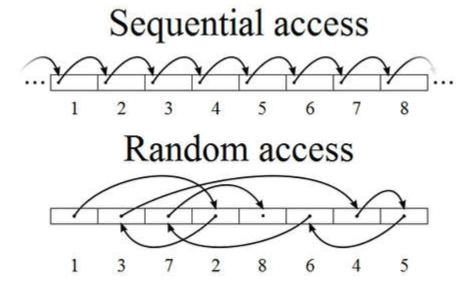

## Kafka Overview

### Kafka

* #### Kafka란, 웹사이트, 어플리케이션, 센서 등에 취합한 데이터를 스트림 파이프라인을 통해 실시간으로 관리하고 보내기 위한 분산 스트리밍 플랫폼이다
* #### 데이터를 생성하는 어플리케이션과 데이터를 소비하는 어플리케이션 간의 중재자 역할을 함으로써 데이터의 전송 제어, 처리, 관리 역할을 한다.
* #### Pub-Sub 모델의 메시지 큐 형태로 동작하며 분산환경에 특화되어 있다
* #### Kafka의 필요성: 기존 데이터 시스템에서 각 애플리케이션과 DB는 end-to-end 방식으로 연결
  * #### 1. 시스템 복잡성 증가
    * #### 통합된 전송 영역이 없어 데이터 흐름을 파악하기 어렵고, 시스템 관리가 어려움
    * #### 특정 부분에서 장애 발생 시 조치 시간 증가 (=> 연결 되어있는 애플리케이션들을 모두 확인해야 하기 때문에)
    * #### HW 교체 / SW 업그레이드 시 관리포인트가 늘어나고, 작업시간 증가 (=> 연결된 애플리케이션에 side effect 가 없는지 확인해야 함)
  
  * #### 2. 데이터 파이프라인 관리의 어려움
    * #### 각 애플리케이션과 데이터 시스템 간의 별도의 파이프라인 존재하고, 파이프라인 마다 데이터 포맷과 처리 방식이 다름
    * #### 새로운 파이프라인 확장이 어려워지면서, 확장성 및 유연성이 떨어짐
    * #### 또한 데이터 불일치 가능성이 있어 신뢰도 감소

  #### < 기존 데이터시스템: end to end  >
  
  #### < 카프카 적용 시스템 >
  
* #### 카프카 적용의 이점 
  * #### 1. 모든 이벤트/데이터의 흐름을 중앙에서 관리할 수 있게 됨
  * #### 2. 새로운 서비스/시스템이 추가되도 카프카가 제공하는 표준 포맷으로 연결하면 되므로 확장성과 신뢰성이 증가
  * #### 3. 개발자는 각 서비스간의 연결이 아닌, 서비스들의 비즈니스 로직에 집중 가능

### Kafka Mechanism
* #### 카프카는 Pub-Sub 모델의 "메세지 큐" 형태로 동작
* #### 메시지/이벤트 브로커와 메시지 큐
  * #### 메시지 큐:  메시지 지향 미들웨어(MOM : Message Oriented Middleware)를 구현한 시스템으로 프로그램(프로세스) 간의 데이터를 교환할 때 사용하는 기술
          
  * #### 메시지 큐의 이점
    * #### 동시성 제어: queue 임시 저장소가 있기 때문에 순차 처리 가능
    * #### 낮은 결합도: 애플리케이션 서버와 분리
    * #### 확장성: producer와 consumer 서비스를 원하는 대로 확장 가능
    * #### 탄력성: consumer 서비스가 다운되더라도 애플리케이션은 무중단, 메시지가 메시지 큐에 여전히 존재
    * #### 보장성: 메시지 큐에 들어간다면 결국 모든 메시지가 consumer 서비스에게 전달됨을 보장 
  
  * #### 메세지 브로커 
    * #### publisher가 생산한 메세지를 메세지 큐에 저장하고, 저장된 데이터를 consumer가 가져갈 수 있도록 중간 다리 역할을 해주는 브로커(broker)라고 볼 수 있다.

    * #### 보통 서로 다른 시스템(혹은 소프트웨어) 사이에서 데이터를 비동기 형태로 처리하기 위해 사용한다. (대규모 엔터프라이즈 환경의 미들웨어로서의 기능)

    * #### 이러한 구조를 보통 pub/sub 구조라고 하며 대표적으로는 Redis, RabbitMQ 소프트웨어가 있고, GCP의 pubsub, AWS의 SQS 같은 서비스가 있다.

    * #### 이와 같은 메세지 브로커들은 consumer가 큐에서 데이터를 가져가게 되면 즉시 혹은 짧은 시간 내에 큐에서 데이터가 삭제되는 특징들이 있다.
  
  * #### 이벤트 브로커 
    * #### 이벤트 브로커 또한 기본적으로 메세지 브로커의 큐 기능들을 가지고 있어 메세지 브로커의 역할도 할 수 있다.
    * #### 이벤트 브로커는 publisher가 생산한 이벤트를 이벤트 처리 후에 바로 삭제하지 않고 저장하여, 이벤트 시점이 저장되어 있어서 consumer가 특정 시점부터 이벤트를 다시 consume 할 수 있는 장점이 있다. (예를 들어 장애가 일어난 시점부터 그 이후의 이벤트를 다시 처리할 수 있음)
    * #### 또한 대용량 처리에 있어서는 메세지 브로커보다는 더 많은 양의 데이터를 처리할 수 있는 능력이 있다.
    * #### 이벤트 브로커에는 Kafka, AWS의 kinesis 같은 서비스가 있다.
* #### Kafka의 동작 방식과 특징
  
  * #### 동작 방식
    * #### 1. publisher는 전달하고자 하는 메세지를 topic을 통해 카테고리화 한다.
    * #### 2. subscriber는 원하는 topic을 구독(=subscribe)함으로써 메시지를 읽어온다.
    * #### 3. publisher와 subscriber는 오로지 topic 정보만 알 뿐, 서로에 대해 알지 못한다.
    * #### 4. kafka는 broker들이 하나의 클러스터로 구성되어 동작하도록 설계
    * #### 5. 클러스터 내, broker에 대한 분산처리는 ZooKeeper가 담당한다.
  * #### 특징
    * #### 1. 대규모 트래픽 처리 및 분산 처리에 효과적
    * #### 2. 클러스터 구성, Fail-over, Replication 같은 기능이 있음
    * #### 3. 디스크에 메세지를 특정 기간동안 저장하여 데이터의 영속성이 보장
    * #### 4. Consumer 장애 시 재처리가 가능하다.
* #### 카프카의 구성요소
  
  * #### Producer 
    * #### 1. 메시지를 만들어서 카프카 클러스터에 전송한다.
    * #### 2. 메시지 전송 시 Batch 처리가 가능하다.
    * #### 3. key값을 지정하여 특정 파티션으로만 전송이 가능하다.
    * #### 4. 전송 acks값을 설정하여 효율성을 높일 수 있다.
    * #### 5. ACKS=0 -> 매우 빠르게 전송. 파티션 리더가 받았는 지 알 수 없다.
    * #### 6. ACKS=1 -> 파티션 리더가 받았는지 확인. 기본값
    * #### 7. ACKS=ALL -> 파티션 리더 뿐만 아니라 팔로워까지 메시지를 받았는 지 확인
  * #### Consumer, ConsumerGroup
    * #### 1. 카프카 클러스터에서 메시지를 읽어서 처리한다.
    * #### 2. 메세지를 Batch 처리할 수 있다.
    * #### 3. 한 개의 컨슈머는 여러 개의 토픽을 처리할 수 있다.
    * #### 4. 메시지를 소비하여도 메시지를 삭제하지는 않는다.
    * #### 5. 컨슈머는 컨슈머 그룹에 속한다.
    * #### 6. 한 개의 파티션은 같은 컨슈머그룹의 여러 개의 컨슈머에서 연결할 수 없다.
  * #### Broker
    * #### 1. 실행된 카프카 서버를 말한다.
    * #### 2. 프로듀서와 컨슈머는 별도의 애플리케이션으로 구성되는 반면, 브로커는 카프카 자체이다.
    * #### 3. Broker(각 서버)는 Kafka Cluster 내부에 존재한다.
    * #### 4. 서버 내부에 메시지를 저장하고 관리하는 역할을 수행한다.
  * #### Topic
    * #### 1. 각각의 메시지를 목적에 맞게 구분할 때 사용한다.
    * #### 2. 메시지를 전송하거나 소비할 때 Topic을 반드시 입력한다.
    * #### 3. Consumer는 자신이 담당하는 Topic의 메시지를 처리한다.
    * #### 4. 한 개의 토픽은 한 개 이상의 파티션으로 구성된다.
  * #### Partition
    * #### 1. 분산 처리를 위해 사용된다.
    * #### 2. Topic 생성 시 partition 개수를 지정할 수 있다. (파티션 개수 변경 가능. *추가만 가능)
    * #### 3. 파티션이 1개라면 모든 메시지에 대해 순서가 보장된다.
    * #### 4. 파티션 내부에서 각 메시지는 offset(고유 번호)로 구분된다.
    * #### 5. 파티션이 여러개라면 Kafka 클러스터가 라운드 로빈 방식으로 분배해서 분산처리되기 때문에 순서 보장 X
    * #### 6. 파티션이 많을 수록 처리량이 좋지만 장애 복구 시간이 늘어난다.
  * #### Offset
    * #### 1. 컨슈머에서 메세지를 어디까지 읽었는지 저장하는 값
    * #### 2. 컨슈머 그룹의 컨슈머들은 각각의 파티션에 자신이 가져간 메시지의 위치 정보(offset) 을 기록
    * #### 3. 컨슈머 장애 발생 후 다시 살아나도, 전에 마지막으로 읽었던 위치에서부터 다시 읽어들일 수 있다.
  * #### Zookeeper
    * #### 1. 분산 애플리케이션 관리를 위한 코디네이션 시스템
    * #### 2. 분산 메시지큐의 메타 정보를 중앙에서 관리하는 역할
  * #### Rebalancing 
    * #### 1. Consmuer Group 의 가용성과 확장성을 확보해주는 개념
    * #### 2. 특정 컨슈머로부터 다른 컨슈머로 파티션의 소유권을 이전시키는 행위
    * #### 3. 리밸런싱 중에는 컨슈머가 메세지를 읽을 수 없음.
    * #### 4. Rebalancing Case
      * #### Consumer Group 내에 새로운 Consumer 추가
      * #### 특정 Consumer 장애로 소비 중단
      * #### Topic 내에 새로운 Partition 추가
  * #### Cluster
    * #### 1. 고가용성 (HA) 를 위해 여러 서버를 묶어 특정 서버의 장애를 극복할 수 있도록 구성
    * #### 2. Broker 가 증가할 수록 메시지 수신, 전달 처리량을 분산시킬 수 있으므로 확장에 유리
  * #### Replication
    * #### 1. Cluster 의 가용성을 보장하는 개념
    * #### 2. 각 Partition 의 Replica 를 만들어 백업 및 장애 극복
      * #### Leader Replica: 각 파티션은 1개의 리더 Replica를 가진다. 모든 Producer, Consumer 요청은 리더를 통해 처리되게 하여 일관성을 보장한다.
      * #### Follower Replica: 각 파티션의 리더를 제외한 Replica 이며 단순히 리더의 메세지를 복제해 백업한다. 만일, 파티션의 리더가 중단되는 경우 팔로워 중 하나를 새로운 리더로 선출한다.

* #### 카프카 주요 설계
  * #### 왜 하나의 topic을 여러개의 partition으로 분산시키는가?
     
    * #### 병렬로 처리하기 위해 분산 저장 한다.
    * #### 카프카의 토픽에 메세지가 쓰여지는 것도 어느정도 시간이 소비된다. 몇 천건의 메세지가 동시에 카프카에 write 되면 병목현상이 발생할 수 있다.
    * #### 따라서 파티션을 여러개 두어서 분산 저장함으로써 write 동작을 병렬로 처리할 수 있다.
  * #### 컨슈머 그룹은 왜 존재할까?
    
    * #### 컨슈머 그룹은 하나의 topic에 대한 책임을 갖고 있다.
    * #### 즉 어떤 consumer가 down된다면, 파티션 재조정(리밸런싱)을 통해 다른 컨슈머가 해당 파티션의 sub을 맡아서 한다
    * #### offset 정보를 그룹간에 공유하고 있기 때문에 down 되기 전 마지막으로 읽었던 메세지 위치부터 시작한다
  * #### 카프카는 왜 속도가 빠를까?
    * #### 1. Sequential I/O
      
    * #### 2. Zero Copy
      
  * #### 파티션의 증가와 감소
    * #### 1. Partition 수를 늘리는 것이 무조건 좋은 방법일까?
      #### 각 파티션은 브로커의 디렉터리와 매핑되고 모든 디렉터리의 파일에 대해 파일 핸들을 열게 된다.
      #### 파티션이 많아질 수록 파일 핸들러의 수가 많아져 리소스가 낭비된다.
      #### kafka는 고가용성을 제공하기 위해 Broker에 대한 message replication factor를 제공하는데,
      #### 이때 복제 옵션을 주어 partition에 들어온 message를 복제할 수 있는데 Partition의 메시지를 복제하는 것을 처리하는데 시간이 걸리게 된다.
    * #### 2. 파티션을  감소시킬 수 없는 이유
      #### 여러 복합적인 이유가 있을 수 있지만 다수 브로커에 분배되어 있는 세그먼트를 다시 재배열하는 것에 상당한 리소스가 들어가기 때문에 파티션을 감소시킬 수 없다.
  * #### 컨슈머 파티션 할당 전략
    * #### 라운드 로빈 파티션 할당 전략
      
      #### 가장 간단한 파티션 할당 전략으로 파티션을 컨슈머 그룹 내 모든 컨슈머에게 균등하게 분배한다.
      #### 라운드 로빈의 전략의 장점은 모든 컨슈머에 균등한 파티션 분배가 이뤄지기에 컨슈머를 효과적으로 활용해 성능을 향상시킬 수 있다.
      #### 라운드 로빈 전략의 문제점은 프로토콜을 사용하기에 리밸런싱이 발생할 때 모든 컨슈머가 중단된다. 
      #### 또한 모든 파티션을 균등하게 분배하려 하기 때문에 하나의 컨슈머만 다운되더라도 모든 컨슈머의 리밸런싱이 발생하는 단점이 존재한다.

