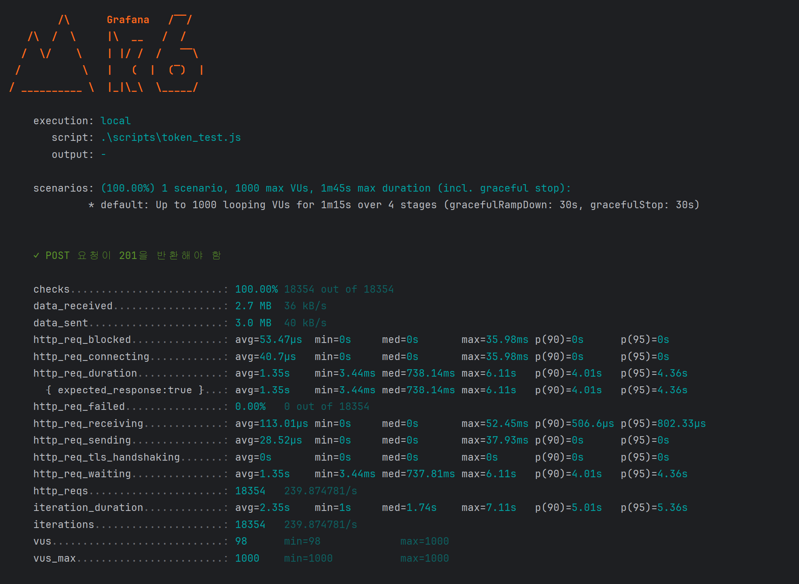
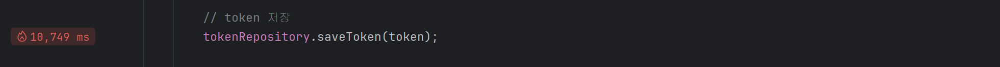
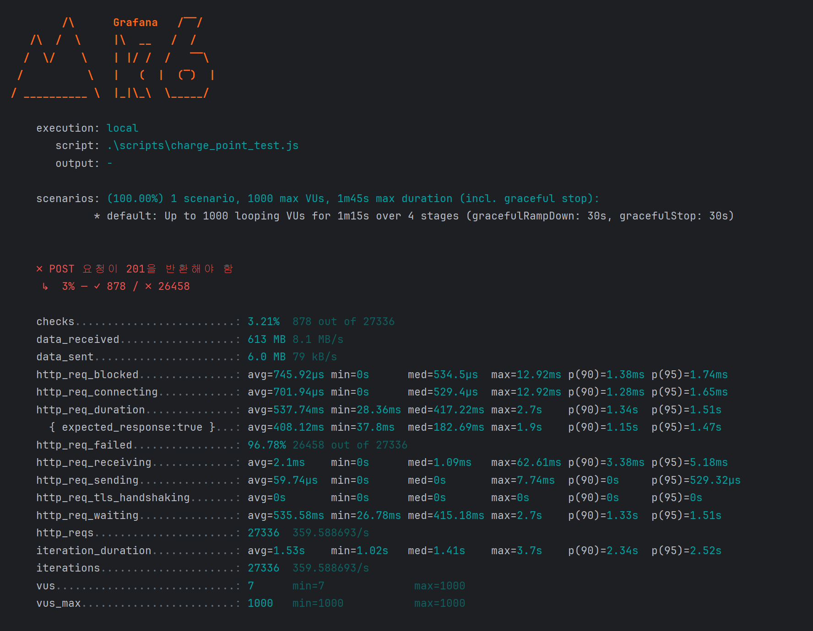
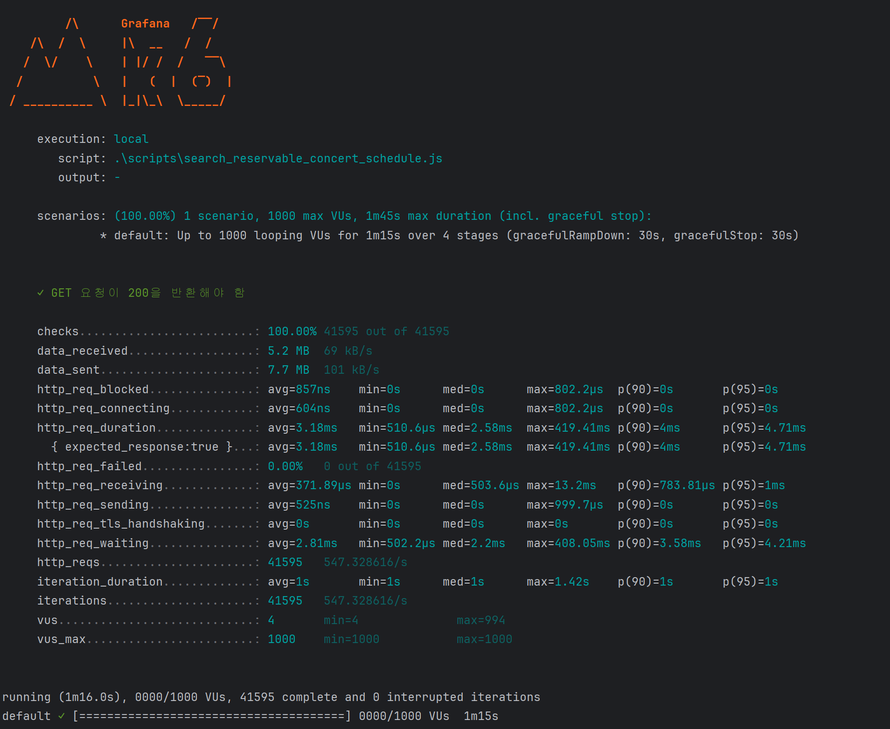
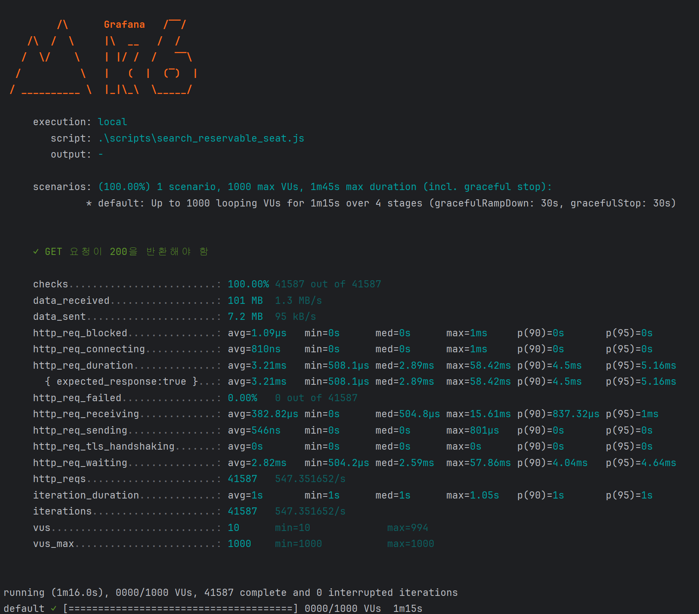
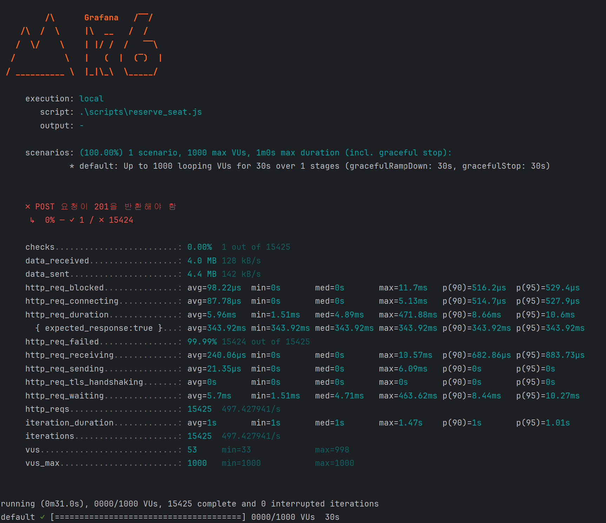

## 부하 테스트 보고서 

### 1. 테스트 환경
#### CPU : AMD Ryzen 9 5950X 16-Core
#### 
#### Memory : 32GB
#### 
#### DB : MySQL
* #### 유저 테이블 1000건 Random Insert
  
  
* #### 콘서트 스케줄 테이블 1000건 Random Insert
  
  
* #### 콘서트 좌석 테이블 50000건 Random Insert
  
  
* #### Index 
  * #### 콘서트 스케줄
    
  * #### 콘서트 좌석
    

### 2. 테스트 필요 대상 
  * #### 대기열 토큰 발행 api
    * #### 목적 : 서버 운영 환경에서, 최초 접속(로그인)이 동시 다발적으로 일어나 토큰 발행에 대한 부하가 순간적으로 많이 가해지는 상황이 발생할 것이라 예상되므로 이를 확인하고자 한다. 
    * #### 시나리오: 5초 동안 최대 700명의 동시 사용자가 접속 후, 30초 동안 최대 300명의 동시 사용자가 접속하고, 5초 동안 최대 1000명의 동시 사용자가 접속한 후, 35초 동안 최대 200명의 동시 사용자가 접속하는 상황을 설정한다.  
    * #### 테스트 스크립트  
        ```javascript
           import http from 'k6/http';
           import { check, sleep } from 'k6';
        
           export let options = {
               stages: [
                   { duration: '5s',  target: 700  },
                   { duration: '30s', target: 300  },
                   { duration: '5s',  target: 1000 },
                   { duration: '35s', target: 200  },
               ],
           };
            
           export default function () {
            
                let params = {
                   headers: {
                     // user로 등록되기만 했다면 같은 userId로 중복해서 접속하는 것을 허용했기 때문에 여러 유저 접속을 하나의 userId로 대체하기로 한다.
                     'X-Custom-UserId': '00365f9d-c6a7-4720-a035-168f15559564',                      
                    },    
                };
            
                let postResponse = http.post('http://localhost:8088/tokens/new', null, params);
            
                check(postResponse, {
                     'POST 요청이 201을 반환해야 함': (res) => res.status === 201,
                });
            
                sleep(1); // 각 요청 후 1초 대기
            }
            
        ```
    * #### 유저 포인트 추가 api
      * #### 목적: 유저 테이블의 포인트 컬럼에 대한 수정이 자주 일어날 것이며, 결제와 같은 다른 비즈니스 로직 내에서 유저 테이블의 포인트 컬럼에 대한 조회가 포함되기 때문에 여러 유저의 포인트 충전과 좌석 예약에 대한 결제가 동시 다발적으로 일어나 유저 테이블을 다루는 지점에서 부하가 순간적으로 많이 가해지는 상황이 발생가능하므로 이를 확인하고자 한다.
      * #### 시나리오: 5초 동안 최대 700명의 동시 사용자가 접속 후, 30초 동안 최대 300명의 동시 사용자가 접속하고, 5초 동안 최대 1000명의 동시 사용자가 접속한 후, 35초 동안 최대 200명의 동시 사용자가 접속하는 상황을 설정한다.
      * #### 테스트 스크립트 
        ```javascript
            import http from 'k6/http';
            import { check, sleep } from 'k6';
        
            export let options = {
               stages: [
                      { duration: '5s', target: 700 },
                      { duration: '30s', target: 300 },
                      { duration: '5s', target: 1000 },
                      { duration: '35s', target: 200 },
                ],
            };
            
            export default function () {
    
               // POST 요청
               let payload = JSON.stringify({
                      userId: '00365f9d-c6a7-4720-a035-168f15559564',
                      type: 0,
                      amount: 3,
               });

               let params = {
                      headers: {
                           'Content-Type': 'application/json',
                      },
               };

               let postResponse = http.post('http://localhost:8088/pointHistories/new', payload, params);

               check(postResponse, {
                   'POST 요청이 201을 반환해야 함': (res) => res.status === 201,
               });

               sleep(1); // 각 요청 후 1초 대기
          }
            
        ```
  * #### 예약 가능 콘서트 스케줄 목록 조회 api
    * #### 목적: 실제 서비스 환경에서 가장 많이 이용될 api이며, 콘서트 스케줄 테이블에는 lock이 사용되고 있고, 콘서트 좌석 예약과 결제 비즈니스 로직 내에서 콘서트 스케줄 테이블의 상태 컬럼에 대한 조회와 수정이 포함되기 때문에 이 지점에서 부하가 순간적으로 많이 가해지는 상황이 발생가능하므로 이를 확인하고자 한다.
    * #### 시나리오: 5초 동안 최대 700명의 동시 사용자가 접속 후, 30초 동안 최대 300명의 동시 사용자가 접속하고, 5초 동안 최대 1000명의 동시 사용자가 접속한 후, 35초 동안 최대 200명의 동시 사용자가 접속하는 상황을 설정한다.
    * #### 테스트 스크립트  
       ```javascript
          import http from 'k6/http';
          import { check, sleep } from 'k6';
        
          export let options = {
             stages: [
                 { duration: '5s', target: 700 },
                 { duration: '30s', target: 300 },
                 { duration: '5s', target: 1000 },
                 { duration: '35s', target: 200 },
             ],
          };
            
          export default function () {
              let concertBasicId = 6;
    
              let params = {
                   headers: {
                        'Authorization' : 1242,
                        // user로 등록되기만 했다면 같은 userId로 중복해서 접속하는 것을 허용했기 때문에 여러 유저 접속을 하나의 userId로 대체하기로 한다.
                        'X-Custom-UserId': '00365f9d-c6a7-4720-a035-168f15559564',                 
                    },    
              };
      
              // GET 요청
              let getResponse = http.get(`http://localhost:8088/concert-details/${concertBasicId}/reservable`, params);
            
              check(getResponse, {
                  'GET 요청이 200을 반환해야 함': (res) => res.status === 200,
              });
            
              sleep(1); // 각 요청 후 1초 대기
         }
        ```
  * #### 예약 가능 콘서트 좌석 목록 조회 api
    * #### 목적: 예약 가능 콘서트 스케줄 목록에서 선택되어 이용되기 때문에 예약 가능 콘서트 스케줄 목록 조회 api보단 이용률이 낮겠지만, 순간적으로 엄청난 요청이 몰릴 수 있는 api이며, 좌석 테이블에는 lock이 사용되고 있고, 예약과 결제 비즈니스 로직 내에서 좌석 테이블을 다루는 지점에서 부하가 예상되므로 이를 확인하고자 한다.
    * #### 시나리오: 5초 동안 최대 700명의 동시 사용자가 접속 후, 30초 동안 최대 300명의 동시 사용자가 접속하고, 5초 동안 최대 1000명의 동시 사용자가 접속한 후, 35초 동안 최대 200명의 동시 사용자가 접속하는 상황을 설정한다.
    * #### 테스트 스크립트
       ```javascript
              import http from 'k6/http';
              import { check, sleep } from 'k6';

              export let options = {
                  stages: [
                      { duration: '5s', target: 700 },
                      { duration: '30s', target: 300 },
                      { duration: '5s', target: 1000 },
                      { duration: '35s', target: 200 },
                 ],
              };

              export default function () {
                  let concertDetailId = 1;

                  let params = {
                          headers: {
                                    'Authorization' : 1242,
                                     // user로 등록되기만 했다면 같은 userId로 중복해서 접속하는 것을 허용했기 때문에 여러 유저 접속을 하나의 userId로 대체하기로 한다.
                                     'X-Custom-UserId': '00365f9d-c6a7-4720-a035-168f15559564',
                  },
              };

              // GET 요청
              let getResponse = http.get(`http://localhost:8088/seats/${concertDetailId}/reservable`, params);

               check(getResponse, {
                         'GET 요청이 200을 반환해야 함': (res) => res.status === 200,
               });

               sleep(1); // 각 요청 후 1초 대기
            }
       ```
  * #### 콘서트 좌석 예약 api
    * #### 목적 : 티켓팅 시 특정 콘서트 좌석에 대한 예약 요청이 동시에 일어나 순간적으로 부하가 치솟는 상황이 발생할 것이라 예상되므로 이를 확인하고자 한다.
    * #### 시나리오 : 5초 동안 최대 1000명까지 동시에 특정 하나의 좌석에 대한 예약 요청을 위해 접속이 몰리는 상황을 설정한다.
    * #### 테스트 스크립트 
       ```javascript
          import http from 'k6/http';
          import { check, sleep } from 'k6';
        
          export let options = {
             stages: [
                 { duration: '5s', target: 1000 },
             ],
          };
            
          export default function () {
              let params = {
                  headers: {
                      'Authorization' : 1242,
                      // user로 등록되기만 했다면 같은 userId로 중복해서 접속하는 것을 허용했기 때문에 여러 유저 접속을 하나의 userId로 대체하기로 한다.
                      'X-Custom-UserId': '00365f9d-c6a7-4720-a035-168f15559564',
                      'Content-Type': 'application/json',
                  },
              };

              // POST 요청
              let payload = JSON.stringify([{
                  seatId: 7420,
                  userId: '00365f9d-c6a7-4720-a035-168f15559564',
              }]);
              
              // POST 요청
              let postResponse = http.post(`http://localhost:8088/reservations`, payload, params);

              check(postResponse, {
                  'POST 요청이 201을 반환해야 함': (res) => res.status === 201,
              });

              sleep(1); // 각 요청 후 1초 대기
         }
        ```
  * #### 좌석 예약 정보 결제 api
    * #### 목적 : 결제 상태를 완료 상태로 수정하는 요청이 빈번하게 발생하므로 이를 확인하고자 한다.
    * #### 시나리오 : 30초 동안 최대 1000명까지 동시에 자신이 예약한 좌석에 대한 결제 정보를 결제 완료 상태로 수정하는 상황을 설정한다.
    * #### 테스트 스크립트
      ```javascript
          import http from 'k6/http';
          import { check, sleep } from 'k6';
        
          export let options = {
             stages: [
                 { duration: '5s', target: 1000 }, 
             ],
          };
            
          export default function () {
              
              let paymentId =  1 + __ITER;
                
              let params = {
                   headers: {
                     'Authorization' : 1, 
                     // user로 등록되기만 했다면 같은 userId로 중복해서 접속하는 것을 허용했기 때문에 여러 유저 접속을 하나의 userId로 대체하기로 한다.
                     'X-Custom-UserId': 'fdjk553l4l-jrj654gfjl-gjfl90grg-5480gklg',                      
                    },    
              };
              
              // POST 요청
              let postResponse = http.put(`http://localhost:8088/payments/${paymentId}`, null, params);
            
              check(postResponse, {
                 'POST 요청이 201을 반환해야 함': (res) => res.status === 201,
              });
            
              sleep(1); // 각 요청 후 1초 대기
         }
      ```
### 3. 테스트 결과와 분석
  * #### 대기열 토큰 발행 api
      
      
      * #### http_req_duration과 http_req_waiting 지표가 p(90), p(95)에서 4초를 초과할 정도로 높기 때문에 1초 미만으로 낮출 필요가 있어보인다. 
      * #### 해당 지표들의 수치를 낮추기 위해서 대기열 토큰 발행 로직을 DB가 아닌 레디스로 구현하고, 서버 스케일링을 도입할 것이다. 
  * #### 유저 포인트 추가 api
      
      * #### 낙관적 락을 이용하였고 재시도가 이루어지지 않도록 하였기 때문에 http_req_failed 지표가 높은 것
      * #### http_req_duration과 http_req_waiting의 수치를 낮추기 위해 유저들의 포인트 정보를 캐싱하고 서비 스케일링을 수행할 것이다.
  * #### 예약 가능 콘서트 스케줄 목록 조회 api
      
      * #### http_req_duration과 http_req_waiting의 수치를 낮추기 위해 콘서트 스케줄 정보를 캐싱하고 서버 스케일링을 수행할 수 있다.
  * #### 예약 가능 콘서트 좌석 목록 조회 api
      
      * #### http_req_duration과 http_req_waiting의 수치를 낮추기 위해 콘서트 좌석 정보를 캐싱하고 서버 스케일링을 수행할 수 있다.
  * #### 콘서트 좌석 예약 api
      
    *  #### 한 좌석에 대한 동시 다발적인 요청 중 단 하나의 요청만 예약에 성공해야함에 따라, 공유락을 이용하였기 때문에 http_req_failed가 높은 것이다.
    *  #### http_req_duration과 http_req_waiting의 수치를 낮추기 위해 콘서트 스케줄 정보와 좌석 정보를 캐싱할 수 있다.
### 4. 가상 장애 대응
  * #### 대기열 토큰 발행 로직에서 장애 발생하여 콘서트 예약 시스템 메뉴들이 이용 불가해진 상황
    * #### 장애 탐지
      #### 평시에 운영 중인 Grafana 모니터링  시스템을 통해 대기열 토큰 발행 로직에서의 최초 장애 발생을 인지한다.
    * #### 장애 전파
      #### Slack Alarm Bot이나 pager duty. squad cast를 연동하여 순차적으로 장애를 전파한다.
    * #### 장애 복구
      #### 대기열 토큰을 발행받으려는 요청이 순간적으로 치솟아 생긴 장애로, 캐싱을 도입하거나 서버 스케일링을 수행함으로써 장애를 해결한다.
    * #### 장애 보고
      #### 대기열 토큰 로직에서 장애가 발생한 원인을 분석한 보고서를 제출한다.
    * #### 장애 회고
      #### 팀원들과 장애 상황(원인, 종류, 타임라인 등)을 공유하며, 해결한 히스토리를 기록으로 남겨둔다.
    